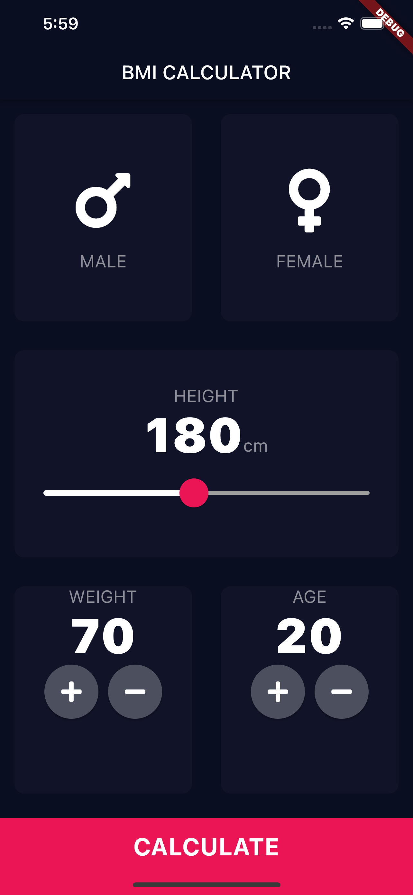

# bmi_calculator
Personal project of a BMI Calculator built in flutter
The application has 2 screens one to capture the results, another to display them to the user

# Home Screen

# Result Screen
![](images/page1.png

